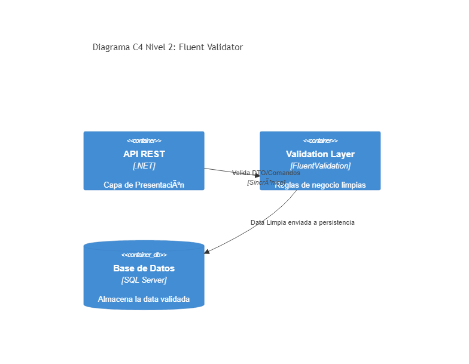

# 01. Fluent Validator

## Resumen Ejecutivo
Delega la lógica de validación de modelos (DRY) a clases separadas en lugar de contaminar los controladores o entidades mediante DataAnnotations. FluentValidation permite crear reglas complejas y testeables.

## Diagrama C4 Nivel 2 (Contenedores)

## Tip de .NET 9
La introducción de AOT (Ahead-of-Time compilation) más pulido en .NET 9 favorece validadores que eviten reflexión profunda, haciendo FluentValidation aún más rápido como parte del request pipeline de las Minimal APIs.