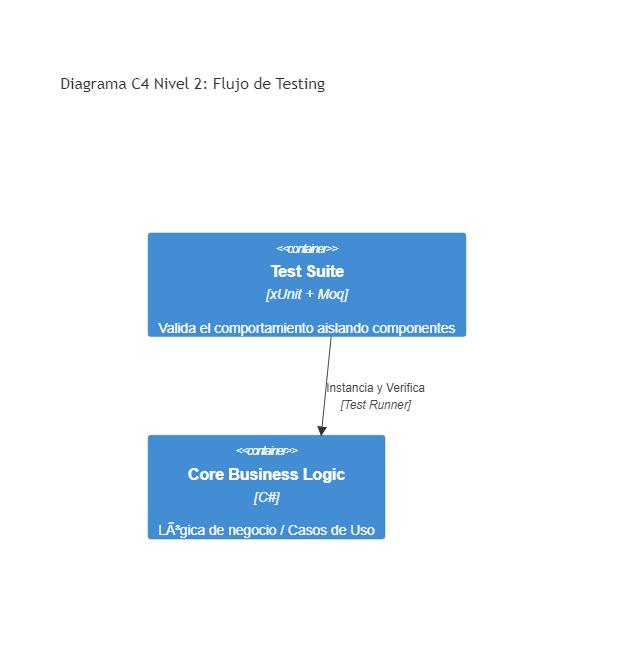

# 01. Unit Testing

## Resumen Ejecutivo
Implementa pruebas de asilamiento para asegurar la calidad de la lógica de negocio y validación, evitando regresiones (generalmente con xUnit, NSubstitute y Moq).

## Diagrama C4 Nivel 2 (Contenedores)

## Tip de .NET 9
.NET 9 introduce mejoras sustanciales en `MSTest.Sdk` y tiempos de ejecución del testing paralelo, recomendando el uso nativo de características de fake-time `TimeProvider` para probar lógicas asíncronas o demoradas.