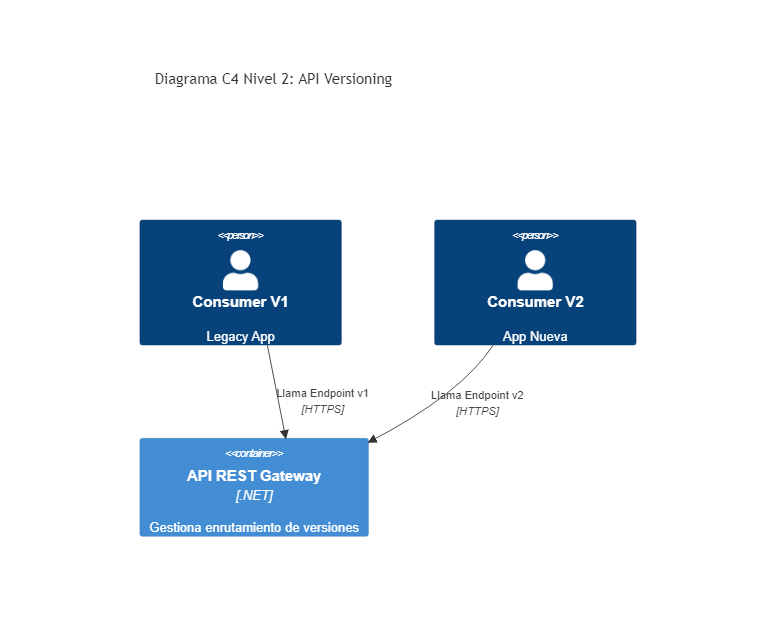

# 02. API Versioning

## Resumen Ejecutivo
Maneja el ciclo de vida de los endpoints, permitiendo la evolución de contratos (DTOs) sin romper los clientes actuales, implementando versionado por URL, Header o Query String.

## Diagrama C4 Nivel 2 (Contenedores)

## Tip de .NET 9
Con .NET 9, el soporte de versionamiento viene nativamente robustecido en conjunción con los nuevos esquemas para OpenAPI endpoints automáticos en Minimal APIs, facilitando mapear `MapGroup("/v{version:apiVersion}")`.