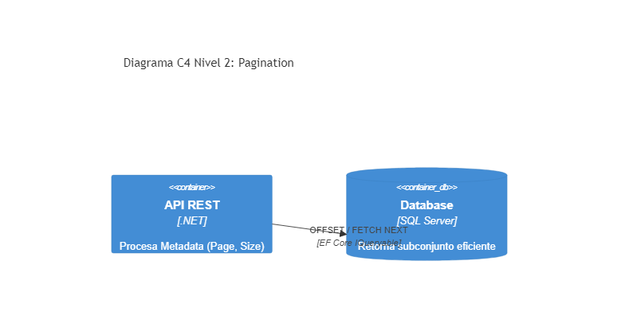

# 02. Pagination

## Resumen Ejecutivo
Protege el servidor procesando la consulta de grandes volúmenes de datos en pequeños lotes, reduciendo el consumo de I/O en la DB y el ancho de banda.

## Diagrama C4 Nivel 2 (Contenedores)

## Tip de .NET 9
El EF Core de .NET 9 ahora optimiza aún más consultas dependientes `Skip()` y `Take()` mediante el compilador LINQ interno e incluye mejores soportes a nivel base de datos relacional para evitar ineficiencias de paginación lejana (Keyset Pagination recomendada).