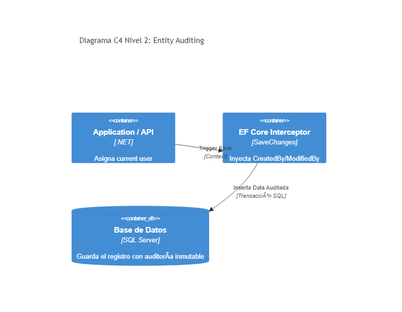

# 03. Entity Auditing

## Resumen Ejecutivo
Soluciona la problemática de rastreo de "Quién creó" o "Quién modificó" una entidad y el registro histórico automatizado interceptando la persistencia.

## Diagrama C4 Nivel 2 (Contenedores)

## Tip de .NET 9
Implementar EF Core `SaveChangesInterceptor` o los eventos del DbContext en su última actualización, los cuales aprovechan optimizaciones en modo pool de contextos (`DbContextPooling`) haciéndolo casi cero overhead histórico.