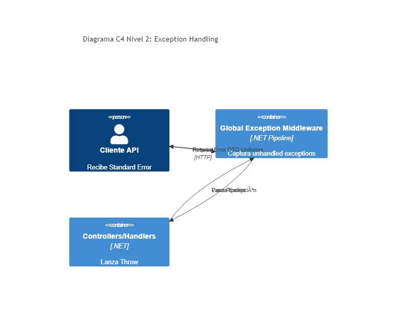

# 03. Exception Handling Middleware

## Resumen Ejecutivo
Centraliza y estandariza las respuestas de error en formato ProblemDetails o formatos genéricos en la API. Evita los repetitivos bloques try-catch dentro de los controladores.

## Diagrama C4 Nivel 2 (Contenedores)

## Tip de .NET 9
Utilizar `IExceptionHandler` introducido recientemente y madurado en .NET 9. Este pattern reemplaza a los middlewares tradicionales custom y se registra de forma limpia vía `app.UseExceptionHandler()`.