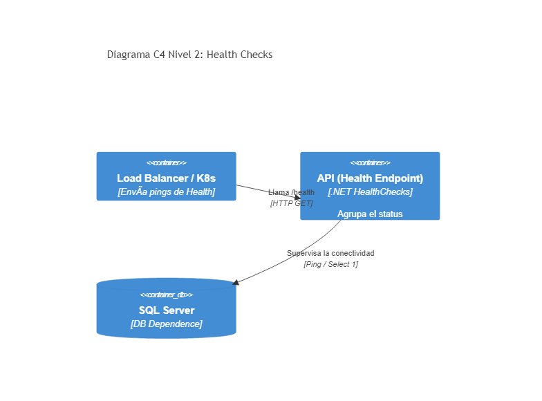

# 04. Health Checks

## Resumen Ejecutivo
Expone endpoints dedicados a monitorear la salud (Liveness y Readiness) de la aplicación y dependencias externas.

## Diagrama C4 Nivel 2 (Contenedores)

## Tip de .NET 9
Aprovechar las métricas integradas de OpenTelemetry incluidas nativamente junto con HealthChecks en .NET 9. Ahora las comprobaciones de estado emiten eventos OpenTelemetry sin configuraciones pesadas extra.