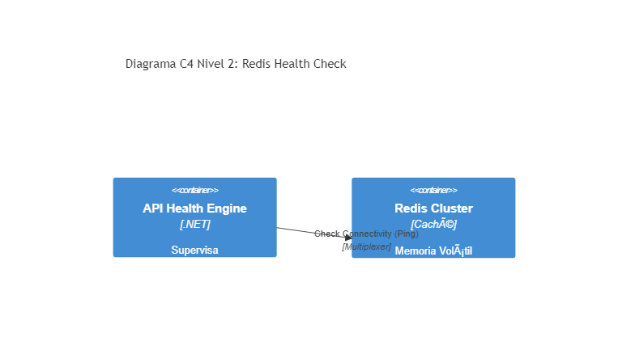

# 04. Redis Health Check

## Resumen Ejecutivo
Supervisión del Caché Distribuido (Redis), detectando mediante un Heartbeat si la degradación de performance se debe a pérdida de conexión e informando el estatus general.

## Diagrama C4 Nivel 2 (Contenedores)

## Conexión con el Objetivo (99. Target Architecture)
Que falle Redis requerirá un patrón circuit-breaker para pasar directo a la base de datos relacional. El Health check avisa a los orquestadores de la intermitencia en el cluster distribuido de Arquitectura de Referencia.

## Tip de .NET 9
Incorporar a Redis dentro del ecosistema modernizado de .NET Aspire, orquestando este servicio con métricas de salud automáticas preconfiguradas AOT.
