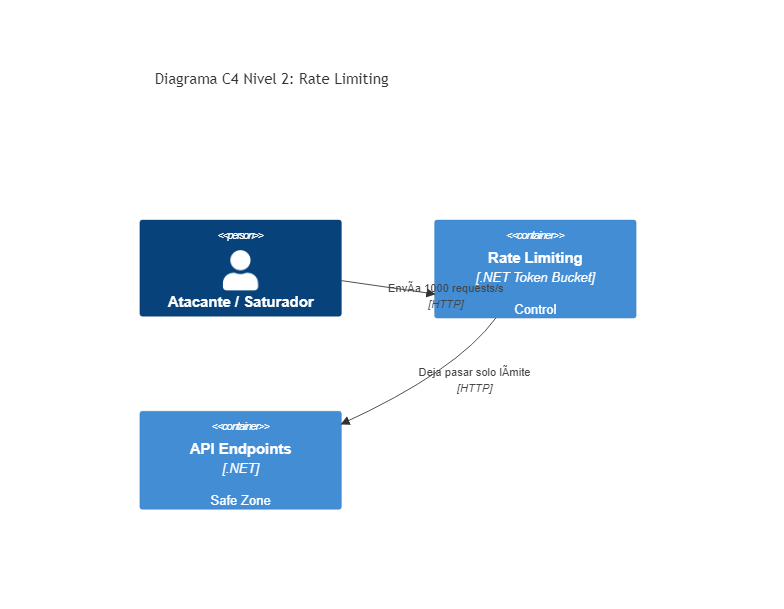

# 05. Rate Limiting

## Resumen Ejecutivo
Protege a la aplicación de ataques de denegación de servicio (DDoS) y del uso excesivo acaparando recursos limitando los requests por usuario/token.

## Diagrama C4 Nivel 2 (Contenedores)

## Tip de .NET 9
El paquete nativo optimizado en .NET 9 (`Microsoft.AspNetCore.RateLimiting`) soporta Concurrency Limits y Token Buckets directamente conectados a los Claims del usuario web limitando las necesidades de gateways de firewall externos temporales en staging.