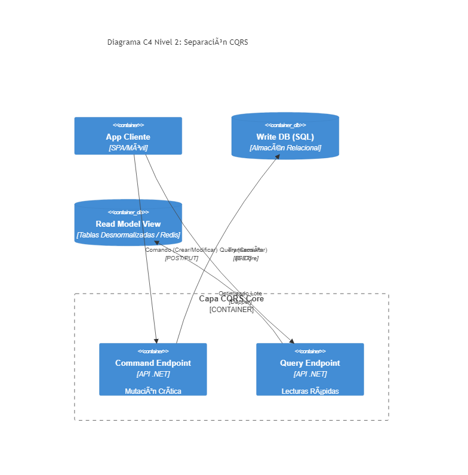

# 06. CQRS Commands

## Resumen Ejecutivo
Divide de forma radical las operaciones que leen datos (Queries) de aquellas que mutan o cambian el estado (Commands), asegurando el principio de Responsabilidad Única.

## Diagrama C4 Nivel 2 (Contenedores)

## Conexión con el Objetivo (99. Target Architecture)
En la Arquitectura de Referencia, las escrituras pueden volverse asíncronas para absorber latencias. Al separar explícitamente qué capa escribe, es muy fácil transformar los Commands en mensajes de un broker y lograr escalabilidad elástica.

## Tip de .NET 9
Usar Tipos Record y Structs (donde aplique) con inmutabilidad pura. El compilador en .NET 9 perfecciona la inicialización rápida de objetos, reduciendo asignaciones GC al parsear JSON complex requests de Commands.
