# Documento Técnico: Patrón CQRS - Mediator Pipeline

## 1. Inyección de Dependencias (DI)
El código responsable de inyectar MediatR y orquestar el descubrimiento dinámico de todos los Handlers (Comandos y Queries) se encuentra en el archivo `Pacagroup.Ecommerce.Application.Main/ConfigureServices.cs`.

Así se estructura exactamente el registro:
```csharp
using Microsoft.Extensions.DependencyInjection;
using System.Reflection;

namespace Pacagroup.Ecommerce.Application.UseCases
{
    public static class ConfigureServices
    {
        public static IServiceCollection AddApplicationServices(this IServiceCollection services)
        {
            // --- REGISTRO DE MEDIATR ---
            // Escanea y registra automáticamente todos los IRequestHandler
            // dentro del ensamblado actual de forma dinámica.
            services.AddMediatR(cfg => {
                cfg.RegisterServicesFromAssembly(Assembly.GetExecutingAssembly());
            });
            
            services.AddAutoMapper(Assembly.GetExecutingAssembly());
            
            // ... (Registro explícito de otros servicios de la aplicación)
            return services;
        }
    }
}
```

---

## 2. Flujo del Pipeline 
MediatR actúa como un embudo (pipeline) que separa al invocador de la lógica de negocio final. Aunque en este proyecto puntual la inclusión de `ValidationBehavior` y `LoggingBehavior` se profundizan en otros bloques del repositorio, lógicamente un pipeline maduro atraviesa las siguientes capas antes de llegar a la manipulación de base de datos (`CreateCustomerHandler`).

```mermaid
sequenceDiagram
    autonumber
    participant API as EndPoint (Controller)
    participant Bus as MediatR Bus
    participant Log as LoggingBehavior
    participant Val as ValidationBehavior
    participant Hnd as Target Handler
    
    API->>Bus: Send(CreateCustomerCommand)
    activate Bus
    
    Bus->>Log: Handle()
    activate Log
    Log->>Log: Inicia cronómetro y TraceId
    
    Log->>Val: Next()
    activate Val
    Val->>Val: Intercepta y valida sintaxis (FluentVal)
    
    Val->>Hnd: Next() (Válido)
    activate Hnd
    Hnd->>Hnd: Lógica Core de Negocio
    Hnd-->>Val: Retorna Response <T>
    deactivate Hnd
    
    Val-->>Log: Retorna Response <T>
    deactivate Val
    
    Log->>Log: Calcula TimeSpan (Latencia transcurrida)
    Log-->>Bus: Pipeline completado
    deactivate Log
    
    Bus-->>API: Resultado del Command devuelto
    deactivate Bus
```



---

## 3. Patrón Repositorio
Para aislar la dependencia a la capa de infraestructura, el CQRS Handler no inyecta el `ApplicationDbContext` directamente. En su lugar, el `CreateCustomerHandler.cs` delega esto por completo mediante el UnitOfWork:

```csharp
// En CreateCustomerHandler.cs
public class CreateCustomerHandler : IRequestHandler<CreateCustomerCommand, Response<bool>>
{
    private readonly IUnitOfWork _unitOfWork;
    
    public CreateCustomerHandler(IUnitOfWork unitOfWork, IMapper mapper)
    {
        _unitOfWork = unitOfWork;
        // ...
    }
    
    public async Task<Response<bool>> Handle(...)
    {
        // Se abstrae la tecnología detrás de IUnitOfWork y ICustomersRepository
        response.Data = await _unitOfWork.Customers.InsertAsync(customer);
        return response;
    }
}
```

Si saltamos hacia `Pacagroup.Ecommerce.Persistence/Repositories/UnitOfWork.cs`, descubrimos que este patrón Repositorio está fuertemente acoplado en el fondo a Entity Framework Core (no a Dapper), inyectando el contexto de EF:
```csharp
// En UnitOfWork.cs
public class UnitOfWork : IUnitOfWork
{
    private readonly ApplicationDbContext _applicationDbContext;
    public ICustomersRepository Customers { get; }

    public UnitOfWork(ICustomersRepository customers, ApplicationDbContext applicationDbContext)
    {
        Customers = customers;
        _applicationDbContext = applicationDbContext;
    }
    
    public async Task<int> Save(CancellationToken cancellationToken)
    {
        // Disparo único de la transacción a SQL
        return await _applicationDbContext.SaveChangesAsync(cancellationToken);
    }
}
```

---

## 4. Tip .NET 9 Avanzado (Impacto de Native AOT)
> [!WARNING]
> En .NET 9, el ecosistema de microservicios está migrando activamente a **Native AOT** (Ahead-of-Time compilation) para habilitar aplicaciones que arranquen en milisegundos con uso nulo del motor JIT. 

**Problema:**  
El código actual usa `Assembly.GetExecutingAssembly()` y Reflection dinámica en tiempo de ejecución para escanear y encontrar quién implementa `IRequestHandler`. AOT es enemigo por defecto de la reflexión; en la compilación nativa los tipos no referenciados explícitamente se truncan (Trimming), provocando que este código falle en producción o no logre encontrar tus Handlers.

**Solución Alternativa 100% C# .NET 9:**  
Evitar la recolección estática y pasar a la **generación de código fuente (Source Generators)** que hace el mapeo en tiempo de diseño. En la comunidad .NET avanzada, se recomienda reemplazar la librería tradicional genérica `MediatR` por **`Mediator` (de Martinoth)**, un clon directo construido específicamente para ser compatible con AOT. Éste inyecta en el compilador la conexión entre los Commands y los Handlers sin usar Reflection. Esto hace que tu Pipeline CQRS arranque notablemente más rápido y consuma menos memoria en los pods distribuidos (ideal para la Arquitectura de Referencia).
