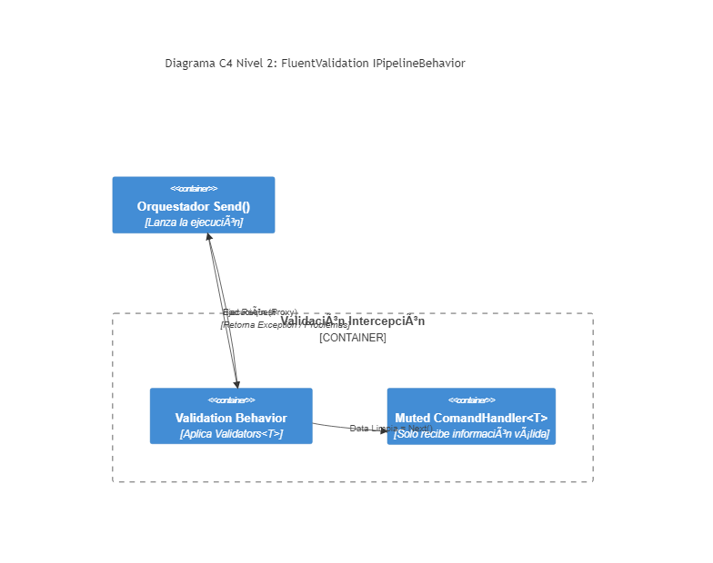

# 06. FluentValidation with MediatR

## Resumen Ejecutivo
Todo flujo (Command) disparado hacia MediatR interseca con un filtro global (Pipeline Behavior). Si el request viola alguna regla de sintaxis/negocio estricta, FluentValidation frena la ejecución limpiamente antes de ingresar al Core Database Handler.

## Diagrama C4 Nivel 2 (Contenedores)

## Tip de .NET 9
Se sugiere la implementación sobre Option Types / Patrones Result (`Result<T>`) dentro del Pipeline Behavior para minimizar Exceptions pesadas en el stacktrace y favorecer la latencia de respuesta estricta sin allocation.