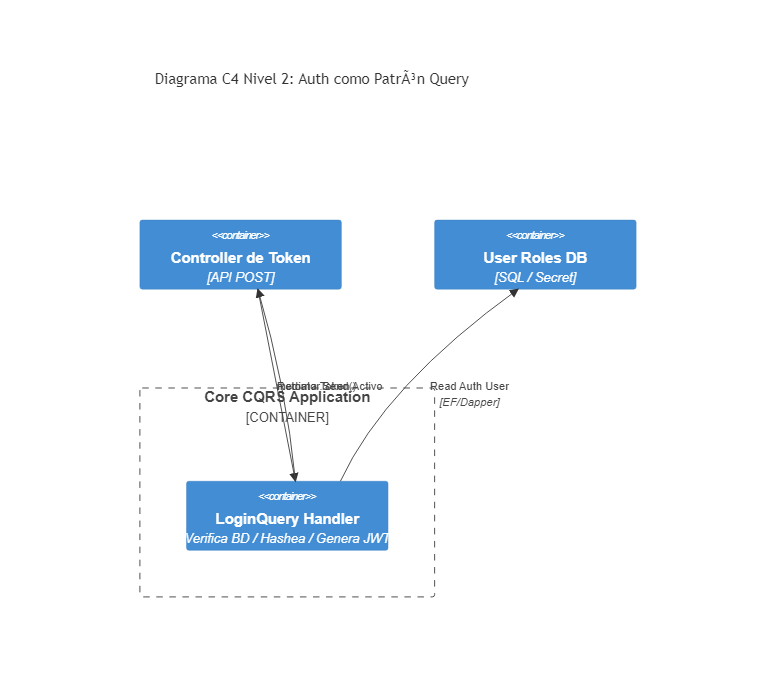

# 06. Login with MediatR

## Resumen Ejecutivo
Delega una operación usualmente atada al controlador HTTP (como generar un Token JWT y validar una password) en un ciclo de vida `IRequestHandler` interno tipo (Query = "Dame un Token JWT válido para este User/Pass").

## Diagrama C4 Nivel 2 (Contenedores)

## Conexión con el Objetivo (99. Target Architecture)
Preparación fundamental. Trasladar el login a la lógica interna de la aplicación abstrae el gateway. En un futuro, The Arquitectura de Referencia Arch Target podría sustituir el handler por un simple redirect request a Duende IdentityServer u OAuth2 Cloud, alterando 0% la capa HTTP.

## Tip de .NET 9
Implementar la modernizada API pura de JsonWebTokens de framework para modelar firmas criptográficas sin la penalización histórica en el thread que traía el viejo pipeline JwtSecurityTokenHandler incorporando mayor escalabilidad.
