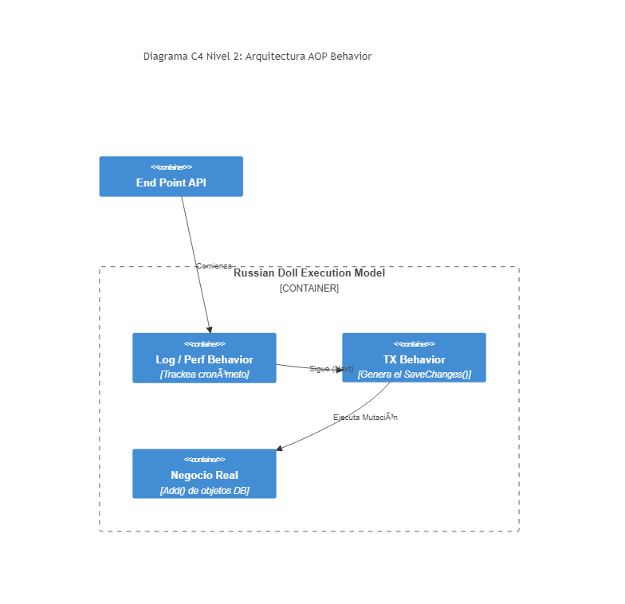

# 06. MediatR Pipeline Behaviors

## Resumen Ejecutivo
Lleva AOP (Aspect Oriented Programming) a nivel aplicativo, permitiendo aplicar "middlewares lógicos" transaccionales (como Logging global de latencias, Transaction Tracking DB UnitOfWork) a cualquier Comando invocado.

## Diagrama C4 Nivel 2 (Contenedores)

## Conexión con el Objetivo (99. Target Architecture)
La observabilidad total en un sistema Target. Un Behavior específico auditará cada Handler lento (por encima de 500ms) arrojando métricas de rendimiento silenciosamente al Application Insights sin mezclar lógica sucia al desarrollador final.

## Tip de .NET 9
Los `LoggerMessageAttribute` integrados permiten que los Logs emitidos en comportamientos globales sean precompilados mediante el generador de origen (`AOT friendly`), alcanzando latencias inperceptibles incluso para los flujos de rastreo más intensos.
