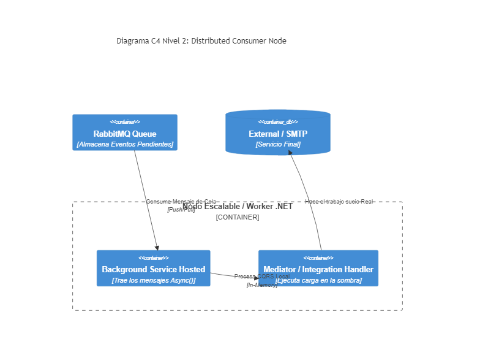

# 07. Distributed Systems - RabbitMQ Consumer

## Resumen Ejecutivo
Escucha de forma perpetua (Background Worker Service) la cola AMQP de RabbitMQ, atrayendo tareas como notificaciones complejas, envío de PDFs, cálculos de stock y confirmando al Broker (ACK) que finalizó el procesamiento con éxito.

## Diagrama C4 Nivel 2 (Contenedores)

## Conexión con el Objetivo (99. Target Architecture)
Los "Workers Node" de la Arquitectura de Referencia serán instancias completamente separadas y autoscaladas. En vez de escalar los costosos Web API (HTTP), escalamos únicamente los micro-nodos consumidores que procesan background intensivo sin límite artificial.

## Tip de .NET 9
La implementación de `IHostedLifecycleService` introduce ganchos (hooks) como Starting, Started, Stopping y Stopped, dándonos el superpoder de pausar cordialmente la cola y drenar los Workers en caso de una cancelación controlada (Kubernetes Terminate Signal).
