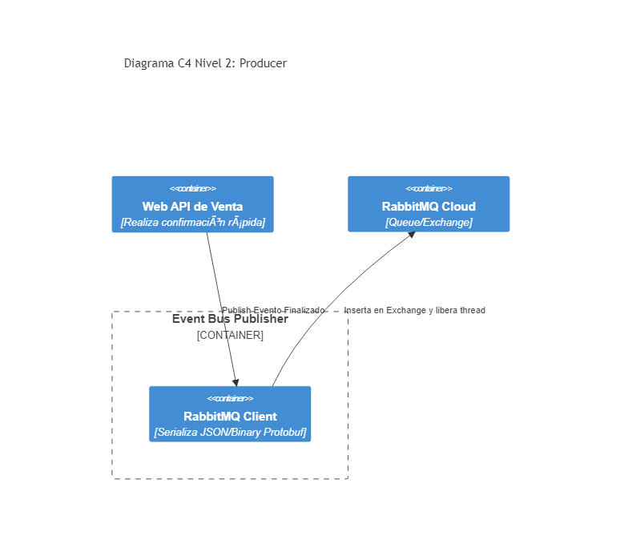

# 07. Distributed Systems - RabbitMQ Producer

## Resumen Ejecutivo
Representa al emisor de la arquitectura asíncrona. En vez de conectarse lento y sincrónico al receptor vía HttpClient, expulsa un Evento (Fire-And-Forget Message AMQP) garantizando desacoplamiento en tiempo para flujos pesados.

## Diagrama C4 Nivel 2 (Contenedores)

## Conexión con el Objetivo (99. Target Architecture)
Crucial para la estabilidad corporativa y la absorción de Black Fridays / picos intensivos. La API "Target Arquitectura de Referencia" debe liberar la conexión del cliente velozmente y no quedarse trabada bloqueando Threads del servidor enviando correos o calculando métricas.

## Tip de .NET 9
Existen eficiencias de Channel Dispatchers (buffering con Channels integrados directos) que permiten enviar Micro-Batches a las colas, permitiendo soportar ráfagas violentas de eventos con la mitad de consumo de CPU al delegarlo a nivel Kernel.
