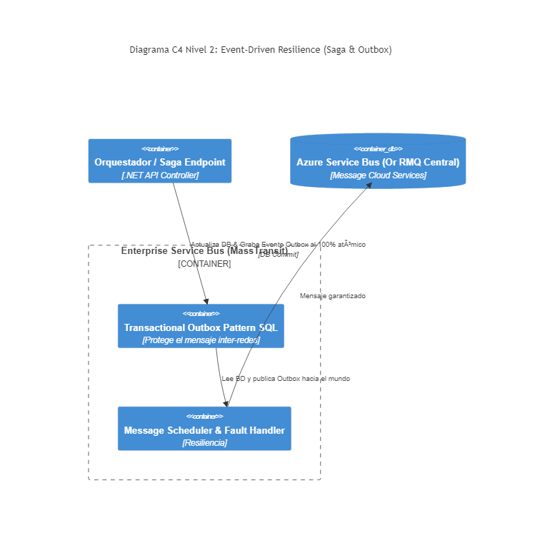

# 07. Service Bus Integration

## Resumen Ejecutivo
Uso avanzado de herramientas del ecosistema distribuido abstraídas detrás de Frameworks formales (ej. MassTransit / Azure Service Bus) posibilitando coreografías multi-nodo complejas, Retry Policies, Inbox/Outbox para transacciones de alta fidelidad atómica.

## Diagrama C4 Nivel 2 (Contenedores)

## Conexión con el Objetivo (99. Target Architecture)
Este componente sella la Arquitectura Empresarial "Arquitectura de Referencia". Es imposible prometer escalabilidad empresarial sin resolver el problema de Dual-Write (qué pasa si la DB guardó la venta pero el RabbitMQ falló internamente y se desconectó la red limitando el envío logístico?).

## Tip de .NET 9
`.NET Aspire` nativo permite mockear, visualizar colas locales y orquestar este monstruo distribuido con OpenTelemetry Tracking en un dashboard moderno sin configurar nada, uniendo el flujo end-to-end (trace-id) distribuido desde la API original hasta tu base asíncrona de Outbox final.
