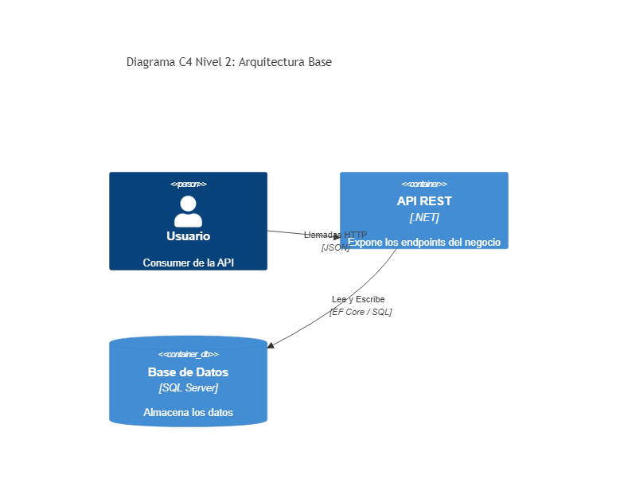
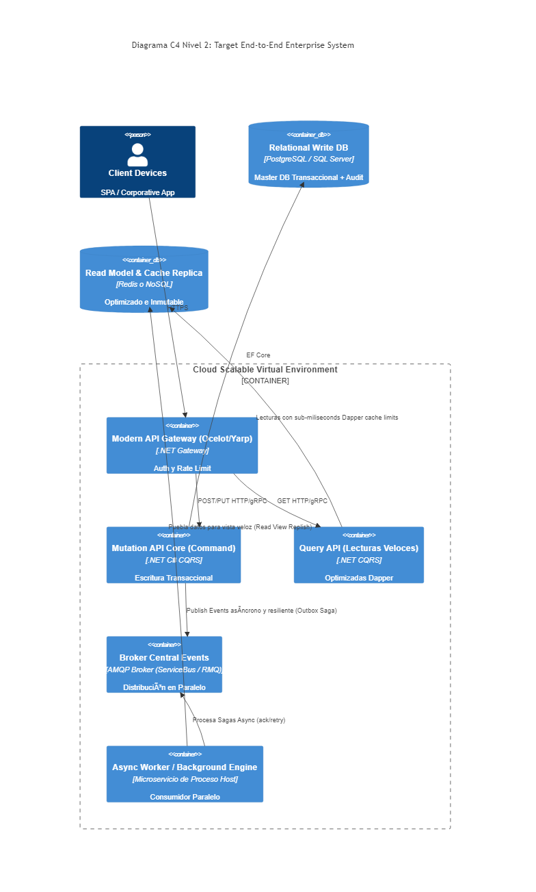

# 🏛️ Architecture Wiki: Ecommerce Project

Bienvenido a la documentación centralizada de arquitectura del proyecto Ecommerce. Este repositorio sigue un enfoque de **Arquitectura Documentada** para garantizar la trazabilidad y la evolución del sistema.

## 🖼️ Visual Showcase
A continuación, se presentan las proyecciones visuales de la evolución del sistema:

### Arquitectura de Base (Inicio)
Representa la estructura inicial de la solución.

### Arquitectura de Destino (Target)
Representa el estado deseado con integración completa de patrones y sistemas distribuidos.

---

## 🛠️ Stack Tecnológico
La solución está construida sobre un ecosistema moderno y escalable:

| Componente | Tecnología | Propósito |
| --- | --- | --- |
| **Runtime** | .NET 9 | Framework base (Migración estratégica) |
| **Broker de Mensajes** | RabbitMQ | Comunicación asíncrona entre servicios |
| **Caché & Salud** | Redis | Optimización de performance y HealthChecks |
| **Base de Datos** | SQL Server | Almacenamiento relacional transaccional |
| **Patrón de Mediación** | MediatR | Implementación de CQRS y Pipeline Behaviors |
| **Acceso a Datos** | Dapper / EF Core | Queries rápidas (Dapper) y Persistencia (EF) |

---

## 📜 Índice de Decisiones (ADR)
Para entender el *porqué* de nuestras elecciones técnicas, consulte los **Architecture Decision Records**:

1.  **[ADR-001: CQRS y MediatR](./98. Architecture Decision Records/ADR-001_CQRS_y_MediatR.md)** - Desacoplamiento de lógica y presentación.
2.  **[ADR-002: Dapper Data Access](./98. Architecture Decision Records/ADR-002_Dapper_Data_Access.md)** - Optimización de lectura de datos.
3.  **[ADR-003: RabbitMQ y Mensajería](./98. Architecture Decision Records/ADR-003_RabbitMQ_y_Mensajeria.md)** - Sistemas distribuidos y MassTransit.
4.  **[ADR-004: Migración a .NET 9](./98. Architecture Decision Records/ADR-004_Migracion_NET_9.md)** - Hoja de ruta tecnológica.

---

## 📚 Guía de Referencia Técnica
Documentación detallada sobre la implementación interna de los patrones:

*   **[Análisis CQRS y Mediator (Carpeta 06)](./06. Patterns CQRS - CQRS Mediator Pipeline/DETALLE_TECNICO.md)**: Explicación de Handlers, Validaciones y Primary Constructors.
*   **[Sistemas Distribuidos y RabbitMQ (Carpeta 07)](./07. Distributed Systems - RabbitMQ Consumer/DETALLE_TECNICO.md)**: Configuración del Consumer, MassTransit y BackgroundServices.

---
*Ultima actualización: 13 de Abril, 2026*
